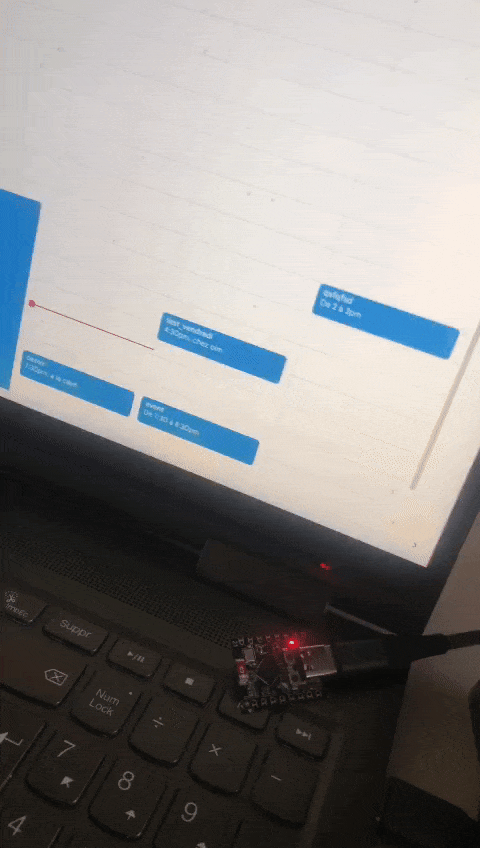

# 📅 ESP32 Google Calendar Monitor

Ce projet connecte un **ESP32-C3 SuperMini** en Wi-Fi, interroge un **Google Calendar** pour récupérer le planning du jour, puis :

- Vérifie s’il y a un événement en cours.
- Si oui, fait clignoter une **LED bleue** (GPIO 8) toutes les 2 s.
- Réitère la vérification du planning toutes les **6 s** (modifiable pour la production).

---

## 🔍 Fonctionnalités

1. Connexion Wi-Fi  
2. OAuth2 + Google Calendar API  
3. Récupération & parsing du planning du jour  
4. Blink LED sur GPIO 8 si un événement est actif  
5. Boucle de vérification périodique (6 s pour tests)

---

## 📂 Structure du projet

```text
TEST_CODE_GOOGLECALENDAR
├── components/
│   ├── config/         ← définitions de configuration (SSID, tokens…)
│   │   ├── CMakeLists.txt
│   │   └── config.h
│   ├── time_utils/     ← gestion du temps, conversion timestamps
│   │   ├── CMakeLists.txt
│   │   ├── time_utils.h
│   │   └── time_utils.c
│   ├── wifi/           ← connexion et gestion Wi-Fi
│   │   ├── CMakeLists.txt
│   │   ├── wifi.h
│   │   └── wifi.c
│   ├── http_client/    ← wrapper HTTP pour l’ESP32
│   │   ├── CMakeLists.txt
│   │   ├── http_client.h
│   │   └── http_client.c
│   ├── oauth/          ← gestion OAuth2 (tokens, rafraîchissement)
│   │   ├── CMakeLists.txt
│   │   ├── oauth.h
│   │   └── oauth.c
│   └── calendar/       ← appel et parsing du Google Calendar
│       ├── CMakeLists.txt
│       ├── calendar.h
│       └── calendar.c
├── main/
│   ├── CMakeLists.txt
│   └── main.c          ← point d’entrée principal
├── img/                ← captures d’écran des tests
│   └── img1.png        ← moniteur série (test du blink LED)
├── CMakeLists.txt
├── sdkconfig
└── sdkconfig.old

Chaque dossier contient :
- Le code source (C/ESP-IDF)
- Les fichiers de configuration (Wi-Fi, pins, OAuth…)
- Les instructions pour le build et le flash

---
## 🖥️ Aperçu du test



