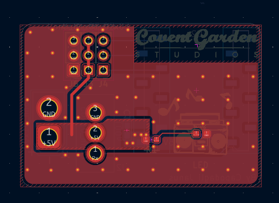
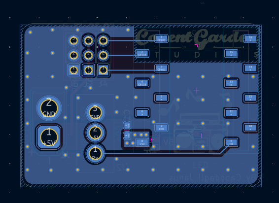
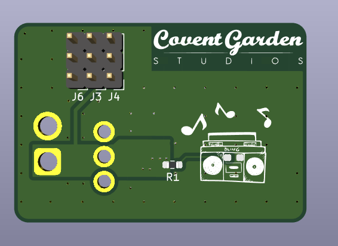
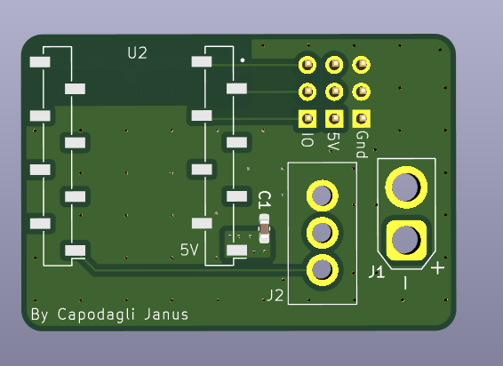

# 🚀 Bienvenue dans le répertoire du PCB d'affichage !

Il s'agit d'un PCB permettant de d'afficher l'heure en contrôlant un ruban de LED néopixels grâce au esp32 connecté au réseau WIFI. 

---

## 📌 Cahier des charges

* Connexion Wi‑Fi assurée par un **ESP32‑C3 SuperMini**
* Alimentation de l'ESP32 et du ruban.
* Contrôl de l'affichage

---

## ⚙️ Matériel utilisé

| Composant                | Référence            | Rôle                                                |
| ------------------------ | -------------------- | --------------------------------------------------- |
| **Microcontrôleur**      | [ESP32‑C3 SuperMini](https://www.sudo.is/docs/esphome/boards/esp32c3supermini/)   | Connexion réseau & logique de commande              |
| **Connecteur MR32-F** | [RT314F05](https://eu.mouser.com/datasheet/2/418/5/ENG_DS_RT1_bistable_0819-728100.pdf)              | Mise sous/hors tension des équipements              |

---

## 📷 Captures d’écran KiCad

---
## 📝 Notes techniques

* Toutes les lignes de commande haute‑puissance sont isolées de la logique 3,3 V via les relais bistables et/ou le DRV8428E.
* Le PCF8575 étend le nombre de GPIO disponibles : il commande à la fois les relais et les canaux d’affichage lumineux.
* Les boîtiers 3D prévoient la circulation d’air et des points de fixation normalisés type rack 19″.

---

*Document rédigé : 3 juin 2025*
