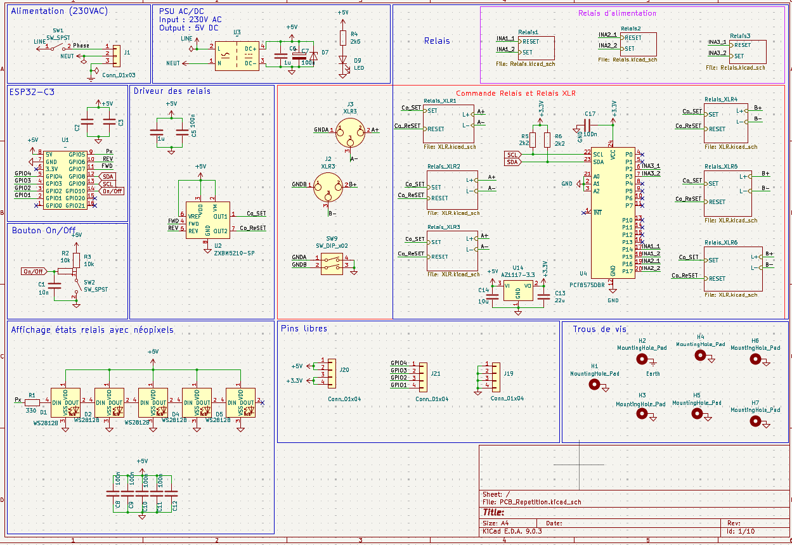
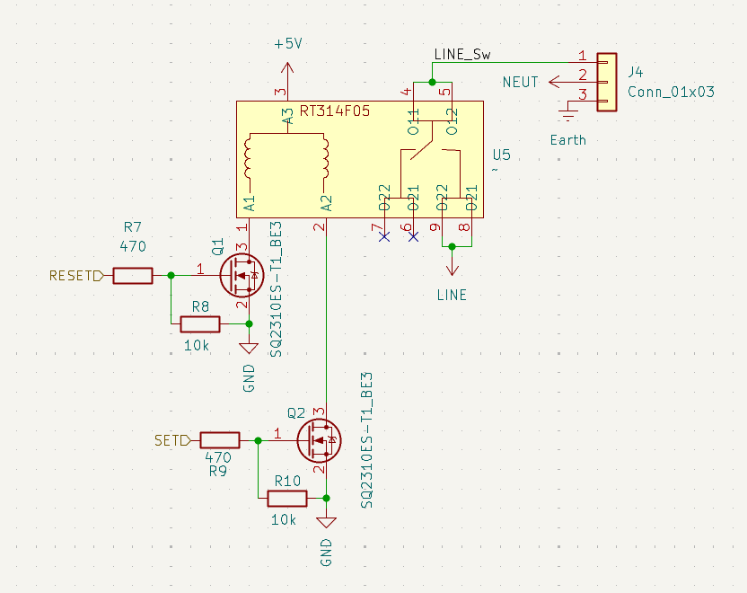
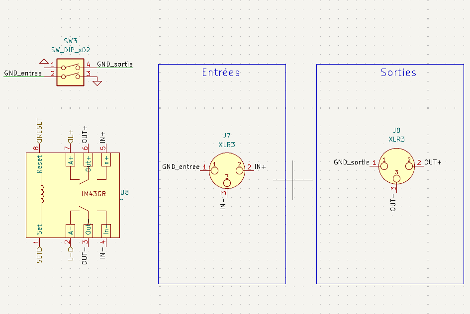
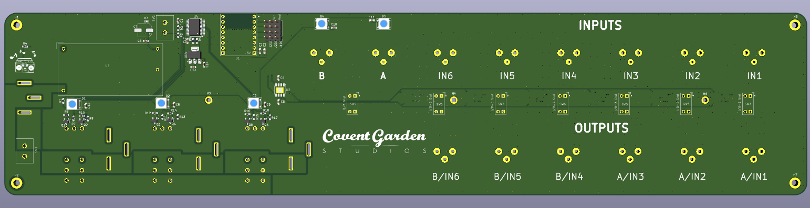
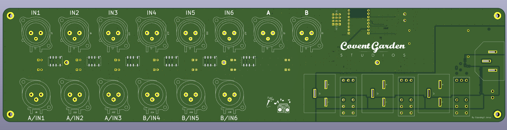

# 🚀 Bienvenue dans le répertoire PCB Rack !

Il s'agit d'un PCB permettant de centraliser l'alimentation des appareils et de les connecter au réseau local. 

---

## 📌 Cahier des charges

* Connexion Wi‑Fi assurée par un **ESP32‑C3 SuperMini**
* Alimentation secteur **centralisée** et sécurisée
* Allumage ciblé et temporisé des différents équipements de la salle à distance
* Affichage d’état et repères visuels (NeoPixels, LED, etc.)

---

## ⚙️ Matériel utilisé

| Composant                | Référence            | Rôle                                                |
| ------------------------ | -------------------- | --------------------------------------------------- |
| **Microcontrôleur**      | [ESP32‑C3 SuperMini](https://www.sudo.is/docs/esphome/boards/esp32c3supermini/)   | Connexion réseau & logique de commande              |
| **Relais SPDT bistable** | [RT314F05](https://eu.mouser.com/datasheet/2/418/5/ENG_DS_RT1_bistable_0819-728100.pdf)              | Mise sous/hors tension des équipements              |
| **Relais DPDT-CO 2fromC** | [IM43GR](https://datasheet4u.com/pdf-down/I/M/4/IM40GR-TE.pdf)              | Relais signal pour coupler les entrées/sorties selon les besoins           |
| **Expandeur d’E/S**      | [PCF8575](https://www.ti.com/lit/ds/symlink/pcf8575.pdf?ts=1749018926956&ref_url=https%253A%252F%252Fwww.ti.com%252Fproduct%252FPCF8575%253Futm_source%253Dgoogle%2526utm_medium%253Dcpc%2526utm_campaign%253Dasc-int-null-44700045336317680_prodfolderdynamic-cpc-pf-google-eu_en_int%2526utm_content%253Dprodfolddynamic%2526ds_k%253DDYNAMIC+SEARCH+ADS%2526DCM%253Dyes%2526gad_source%253D1%2526gad_campaignid%253D11371239072%2526gbraid%253D0AAAAAC068F3FDDT1Gu7VhnBeP5RtPTUzc%2526gclid%253DCj0KCQjwuvrBBhDcARIsAKRrkjepK51Y6q6-dVQGFRZQ84PgWH1wtIsXtqnR2Pfn0NW1HM2rvzqnz_UaAslJEALw_wcB%2526gclsrc%253Daw.ds)              | Bus I²C → sorties GPIO vers drivers & indicateurs   |
| **Driver de puissance**  | [DRV8428E](https://www.ti.com/lit/ds/symlink/drv8428e.pdf)             | Double pont H pour piloter deux relais (ou moteurs) |
| **Module AC/DC**         | [Mornsun MP‑LDE06‑20B05](https://www.farnell.com/datasheets/3155173.pdf) | 230 VAC → 5 VDC isolé                               |
| **LED adressables**      | [WS2812B](https://www.mouser.com/pdfDocs/WS2812B-2020_V10_EN_181106150240761.pdf) (NeoPixels)  | Indication visuelle & rétro‑éclairage               |
| **LED d'alimentation**      | [150060GS55040](https://www.we-online.com/components/products/datasheet/150060GS55040.pdf) (LED verte)  | Indication visuelle               |
| **Diode TVS**      | [824521700](https://docs.rs-online.com/3083/0900766b814c16b5.pdf)   | 12V, 600W, bidirectionnel               |
| **Connecteur XLR male**      | [NC3MAAV-1](https://www.mouser.fr/datasheet/2/289/nc3maav-1-2-1853898.pdf)   | male          |
| **Connecteur XLR femelle**      | [NC3FAAV](https://www.mouser.fr/datasheet/2/289/nc3faav-1-1853630.pdf)   | femelle            |
---

## 📷 Captures d’écran KiCad

---
## 📝 Notes techniques

* Toutes les lignes de commande haute‑puissance sont isolées de la logique 3,3 V via les relais bistables et/ou le DRV8428E.
* Le PCF8575 étend le nombre de GPIO disponibles : il commande à la fois les relais et les canaux d’affichage lumineux.
* Les boîtiers 3D prévoient la circulation d’air et des points de fixation normalisés type rack 19″.

---

*Document rédigé : 3 juin 2025*
